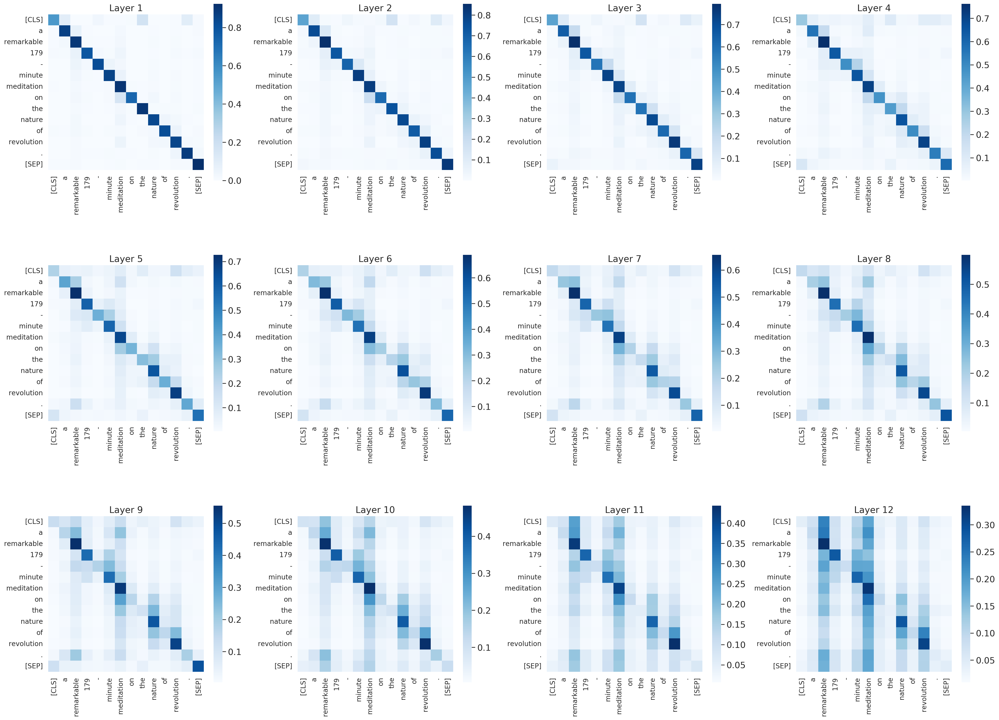

# Measuring the Mixing of Contextual Information in the Transformer

### Implementation of the paper [Measuring the Mixing of Contextual Information in the Transformer](https://arxiv.org/pdf/2203.04212.pdf)
## Abstract
<p>
<em>
The Transformer architecture aggregates input information through the self-attention mechanism, but there is no clear understanding of how this information is mixed across the entire model. Additionally, recent works have demonstrated that attention weights alone are not enough to describe the flow of information. In this paper, we consider the whole attention block --multi-head attention, residual connection, and layer normalization-- and define a metric to measure token-to-token interactions within each layer. Then, we aggregate layer-wise interpretations to provide input attribution scores for model predictions. Experimentally, we show that our method, ALTI (Aggregation of Layer-wise Token-to-token Interactions), provides more faithful explanations and increased robustness than gradient-based methods.
</em>
</p>

<p align="center"><br>

</p><br>

## Environment Setup

Clone this repostitory:
```bash
!git clone https://github.com/javiferran/transformer_contributions.git
```

Create a conda environment using the `environment.yml` file, and activate it:
```bash
conda env create -f ./environment.yml && \
conda activate alti
```

### Text Classification
To analyze model predictions with the proposed (and others) intepretability methods in SST2 dataset:
```bash
Text_classification.ipynb
```

## Usage with Transformers

In our paper we use BERT, DistilBERT and RoBERTa models from Huggingface's [transformers](https://github.com/huggingface/transformers "Huggingface's transformers github") library.

It can be easily extended to other encoder-based Transformers, just add the necessary layers' names in the configuration file: `./src/config.yaml`.

We compare our method with:
- Attention Rollout ([Abnar and Zuidema., 2020](https://arxiv.org/pdf/2005.00928.pdf))
- Attention Rollout + ([Kobayashi et al., 2021](https://arxiv.org/pdf/2109.07152.pdf))
- Gradient-based methods: Gradient Saliency, Integrated Gradients and Gradient x Input

We use [Captum](https://captum.ai/) implementation of gradient-based methods.

The attributions obtained by each method for the specified model and dataset run:
```bash
python ./attributions.py \
  -model $model_name \         # model: bert/distilbert/roberta
  -dataset $dataset \       # dataset to use: sst2/IMDB/Yelp/sva
  -samples $num_samples \       # number of samples
```
The results in  Table 2 can be obtained by running the following command:
```bash
python aupc.py  --model $model_name \ # model: bert/distilbert/roberta
                --dataset $dataset \ # dataset to use: sst2/IMDB/Yelp/sva
                --samples $num_samples \ # number of samples
                --fidelity-type $faith_metric \ # fidelity metric: comp/suff
                --bins \ # use bins (1%,5%,10%,20%,50%) or one-by-one token deletion
```

Please use `$MODELS_DIR` to store fine-tuned models.

## Citation
If you use ALTI in your work, please consider citing:

```bibtex
@misc{alti,
  title = {Measuring the Mixing of Contextual Information in the Transformer},
  author = {Ferrando, Javier and Gállego, Gerard I. and Costa-jussà, Marta R.},
  doi = {10.48550/ARXIV.2203.04212},
  url = {https://arxiv.org/abs/2203.04212},
  keywords = {Computation and Language (cs.CL), FOS: Computer and information sciences, FOS: Computer and information sciences},
  publisher = {arXiv},
  year = {2022},
  copyright = {arXiv.org perpetual, non-exclusive license}
}

````
